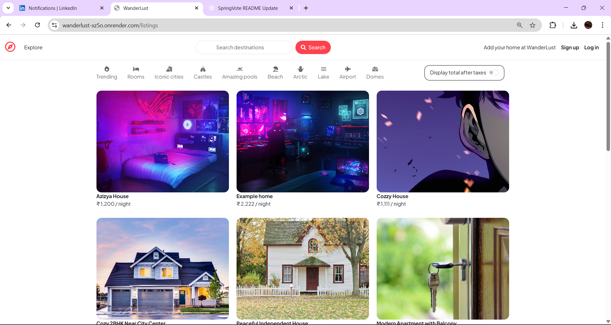
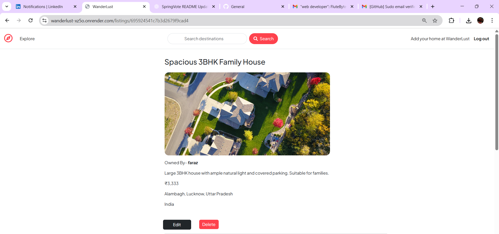
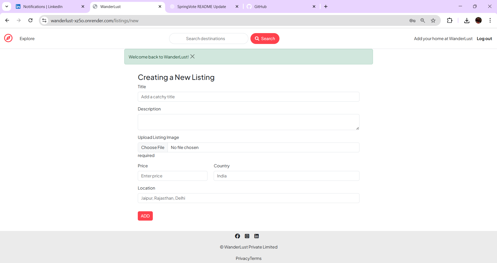
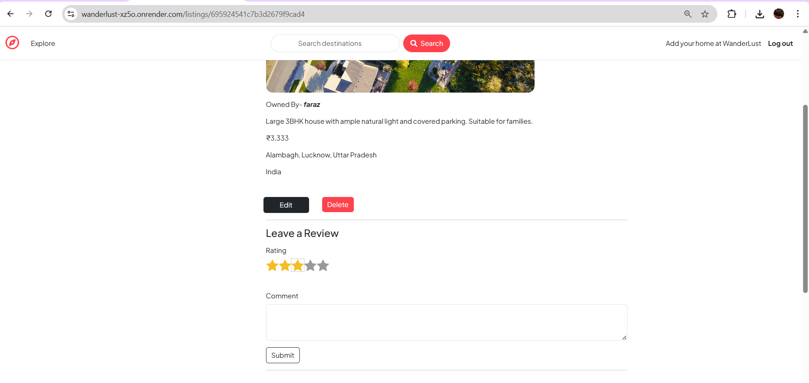
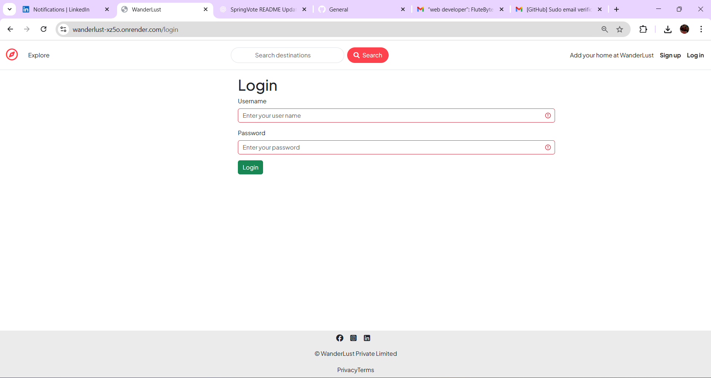

# 🌍 WanderLust — Full-Stack Travel Listing Web Application

WanderLust is a full-stack **travel and accommodation listing platform** inspired by modern rental and travel websites. The application allows users to **explore destinations, create listings, write reviews, and manage content securely**. It is built using **Node.js, Express, MongoDB**, and **EJS**, following the MVC architecture.

This project demonstrates strong backend fundamentals, authentication, authorization, and CRUD operations, making it ideal for **internship applications and academic projects**.

---

## 🚀 Live Demo

**Deployed Application:** https://wanderlust-xz5o.onrender.com

---

## ✨ Features

- 🔐 User authentication & authorization (Login / Signup)
- 🏠 Create, edit, and delete travel listings
- 📝 Add and manage reviews for listings
- 👤 User-specific content control (only owners can edit/delete)
- 📸 Image upload support with cloud configuration
- 🛡️ Secure routes using middleware
- 📦 MVC architecture for clean code structure
- 🌐 Server-side rendered views using EJS

---

## 📸 Screenshots

### Home Page


### Listing Details


### Add New Listing


### Reviews Section


### Login Page


---

## 🛠️ Tech Stack

### Frontend (Server-Side Rendering)
- **EJS** (Embedded JavaScript Templates)
- **HTML5**
- **CSS3**
- **Bootstrap**

### Backend
- **Node.js**
- **Express.js**
- **MongoDB** & **Mongoose**
- **Passport.js** (Authentication)
- **Express-Session**
- **Method-Override**

### Database
- **MongoDB Atlas** (Cloud Database)

### Deployment
- **Render**

---

## 📁 Project Structure

```
wanderlust/
│
├── controllers/          # Business logic and route handlers
├── init/                 # Database initialization scripts
├── models/               # MongoDB schemas and models
├── public/               # Static assets (CSS, JS, images)
├── routes/               # Express route definitions
├── utils/                # Utility functions and helpers
├── views/                # EJS templates
├── screenshots/          # Application screenshots
│   ├── home.png
│   ├── listing.png
│   ├── add-listing.png
│   ├── reviews.png
│   └── login.png
│
├── app.js                # Main application entry point
├── cloudConfig.js        # Cloudinary configuration
├── middleware.js         # Custom middleware functions
├── schema.js             # Validation schemas
├── package.json          # Project dependencies
├── package-lock.json     # Dependency lock file
└── README.md             # Project documentation
```

---

## ⚙️ How to Run Locally

### 1️⃣ Clone the Repository

```bash
git clone https://github.com/Sarfarazsfz/wanderlust.git
cd wanderlust
```

### 2️⃣ Install Dependencies

```bash
npm install
```

### 3️⃣ Environment Variables

Create a `.env` file in the root directory:

```env
CLOUD_NAME=your_cloudinary_name
CLOUD_API_KEY=your_cloudinary_api_key
CLOUD_API_SECRET=your_cloudinary_api_secret
SESSION_SECRET=your_session_secret
MONGO_URI=your_mongodb_atlas_uri
```

### 4️⃣ Run the Application

```bash
npm start
```

Server will run at: **http://localhost:3000**

---

## 🏗️ Architecture Overview

WanderLust follows the **MVC (Model-View-Controller)** architecture pattern:

### Model
- User authentication and profile management
- Listing creation and management
- Review system with ratings

### View
- EJS templating engine for dynamic content
- Responsive Bootstrap UI components
- Server-side rendered pages

### Controller
- Route handlers for listings, reviews, and users
- Business logic separation
- Middleware integration for security

---

## 🔐 Security Highlights

- ✅ Authentication using **Passport.js**
- ✅ Authorization checks for protected actions
- ✅ Secure session management
- ✅ Data validation using schemas
- ✅ Middleware-protected routes
- ✅ Password hashing and encryption
- ✅ CSRF protection
- ✅ Input sanitization

---

## 🎯 Use Cases

- Travel & accommodation listing platform
- CRUD-based full-stack project demo
- Backend-focused internship project
- Academic / college submission
- Portfolio project for web development roles

---

## 🚀 Future Enhancements

- [ ] Add search and filter functionality
- [ ] Implement booking system
- [ ] Add payment gateway integration
- [ ] Enable map integration for location visualization
- [ ] Add email notifications
- [ ] Implement user profile pages
- [ ] Add favorites/wishlist feature
- [ ] Enable social sharing options

---

## 📚 Key Learnings

This project demonstrates proficiency in:
- RESTful API design
- Database modeling and relationships
- Authentication and authorization patterns
- MVC architecture implementation
- Cloud storage integration
- Deployment and DevOps basics

---

## 📝 License

This project is open source and available under the [MIT License](LICENSE).

---

## 📞 Contact

**Developer:** MD SARFARAZ ALAM

- **GitHub:** https://github.com/Sarfarazsfz
- **LinkedIn:** https://www.linkedin.com/in/faraz4237/

---

## ❤️ Acknowledgements

Inspired by modern travel platforms and built to strengthen **full-stack web development fundamentals**.

> *WanderLust — Explore destinations, share experiences, and travel smarter.* 🌍

---

## ⭐ Show Your Support

If you found this project helpful, please consider giving it a ⭐ on GitHub!
